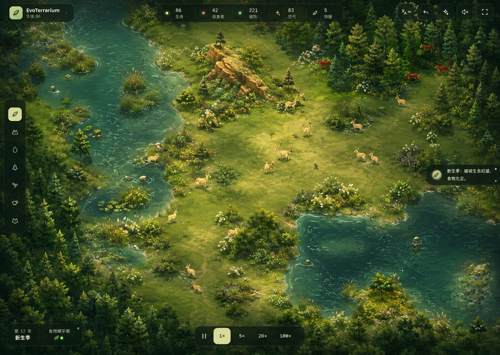
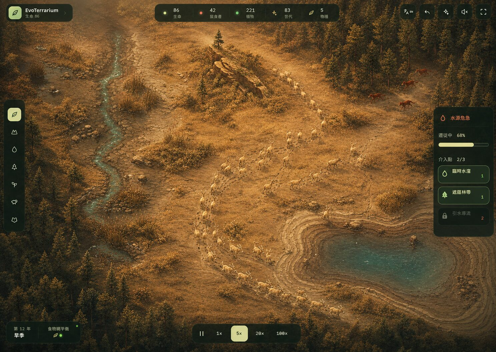
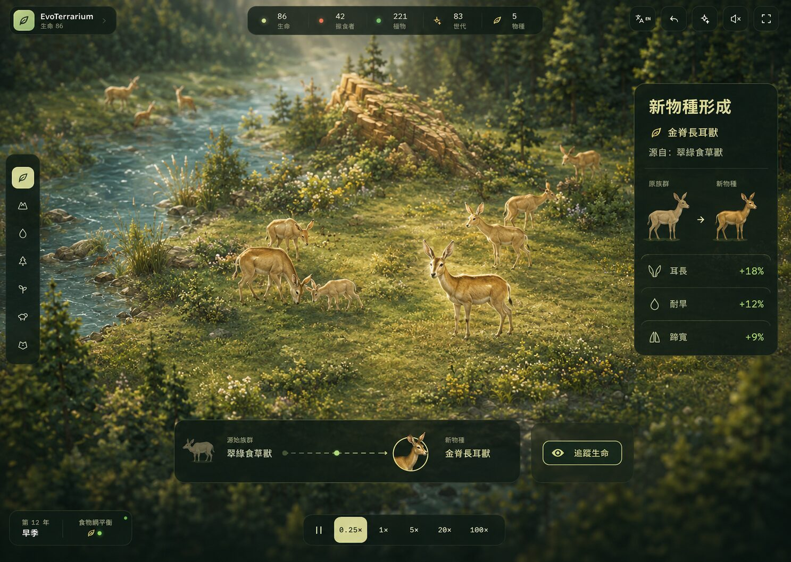

# R9 Living Diorama Visual Specification

Status: visual direction approved; implementation gate in progress

Decision date: 2026-08-09

## 1. Product intent

R9 makes the simulated world itself the primary source of ecological information. Terrain, water, vegetation, animal behaviour and light should explain the state of the ecosystem before the player reads a metric or opens a panel.

The direction is a semi-isometric, hand-crafted **Living Diorama** built from deterministic simulation state. It is not a static illustration, a cinematic skin or a replacement simulation.

The existing product contract remains unchanged:

- The PixiJS world occupies the viewport and stays directly interactive.
- The simulation worker remains authoritative and deterministic.
- React continues to own controls, panels and accessibility content.
- Every environmental change shown in the world must come from real state where that state exists.
- Desktop and mobile retain the same capabilities, with different information layouts where required.

## 2. Approved reference states

### 2.1 World Mode — primary visual baseline

Use for normal observation and creation. Preserve the clear river, lake, grassland, forest and rocky-region hierarchy, but do not reproduce the concept image pixel-for-pixel.

Required qualities:

- The world remains more visually prominent than the HUD.
- Water, shore, meadow, grass and forest are readable without a grid overlay.
- Vegetation density reflects habitat and resource state.
- Grazers and hunters remain selectable at the default camera scale.
- Routine behaviour is visible through posture and movement rather than permanent labels.

### 2.2 Challenge State — drought and migration

Use for V1.1 challenge and crisis presentation. Drought should appear progressively through shrinking water, local soil damage, vegetation loss, animal concentration and migration before global colour grading becomes strong.

The world must not suddenly become a uniform brown filter. Crisis UI is contextual and collapsible, particularly on mobile.

### 2.3 Event Focus Mode — individual and speciation

Use for V1.3 documentary events and V1.4 deep evolution. It is a temporary camera state, not the default way to play.

Expected sequence:

1. Slow the world to `0.25×` rather than stopping it.
2. Move toward the relevant individual or population.
3. Show the visible phenotype difference before numerical detail.
4. Offer follow, codex and return-to-world actions.
5. Respect reduced-motion and disable-auto-camera preferences.

## 3. State model

| Visual state | Trigger | Camera | UI priority | Exit |
| --- | --- | --- | --- | --- |
| World Mode | Default | Whole ecosystem | Compact world status and tools | Remains active |
| Challenge State | Active scenario or severe pressure | World or affected region | Cause, remaining intervention budget and outcome | Recovery or player exit |
| Event Focus Mode | Birth, hunt, migration, disaster or speciation highlight | Individual, family or group | Event meaning and optional detail | Return to prior camera |

States share one world renderer and art system. They are not separate themes.

## 4. Visual system

### Terrain

- Replace visible rectangular biome seams with deterministic contour variation and transition bands.
- Give shallow and deep water different value, motion and reflection treatment.
- Render a readable shoreline between water and traversable habitat.
- Use subtle elevation shadow and tonal variation for depth; do not imply simulation elevation that does not exist.
- Keep terrain painting immediate and deterministic after `terrainRevision` changes.

### Vegetation and world detail

- Meadows use sparse flowers and fine grass; grass uses broader tufts; forests use layered canopy clusters and undergrowth.
- Detail placement is derived from seed-safe coordinates, never from frame-time randomness.
- Plant entities remain distinct from decorative vegetation.
- Detail density must reduce at distant zoom levels and on constrained devices.

### Creatures

- Keep grazer and hunter silhouettes distinct at the fitted camera scale.
- Genes continue to drive size, colour, ears, legs, tail and markings.
- Life stage and behaviour should progressively gain visible expression in R9.2.
- Avoid persistent emoji, numbers or status badges above every animal.

### Light and weather

- Day phase and season modify light without obscuring biome or creature identity.
- Weather is layered above the world and below essential selection feedback.
- Crisis colour grading is the final signal, not the first signal.

### HUD

- The world remains full-screen.
- Persistent overlays use the existing deep-green, leaf-green and warm-highlight language.
- Panels appear only when context requires them and may not permanently consume one third of the mobile viewport.
- When idle, non-essential controls may fade but must remain discoverable and keyboard accessible.

## 5. Responsive contract

| Area | Desktop | Compact / mobile |
| --- | --- | --- |
| Creation tools | Left floating rail | Bottom tool strip or drawer |
| World status | Compact top cluster | Maximum three primary metrics |
| Detail panel | Right contextual panel | Draggable bottom sheet |
| Event focus subject | Centre-biased | Upper half of viewport |
| Crisis information | Collapsible side card | Bottom sheet; world remains visible |
| Camera gestures | Pointer pan and wheel zoom | One-finger pan and pinch zoom |

Mobile is a separate layout gate. A desktop concept scaled down is not an accepted mobile design.

## 6. Accessibility and motion

- Preserve the existing screen-reader world summary and keyboard paths.
- Selection, critical state and tool previews cannot rely on colour alone.
- Text and controls must retain readable contrast over every climate state.
- Reduced-motion disables decorative drift, pulse, camera travel and non-essential parallax.
- Event Focus Mode must provide a no-auto-camera path.

## 7. Performance budget

R9 rendering may improve appearance without coupling render work to simulation complexity.

- Static terrain geometry rebuilds only when `terrainRevision` changes.
- Simulation snapshots must not regenerate decorative placement.
- R9.1 must expose terrain build time and rolling FPS for repeatable comparison.
- Target at the fitted camera and default population: at least 55 FPS on a typical desktop and 30 FPS on the Mobile Safari Playwright profile.
- A R9 phase cannot introduce more than a 20% median frame-rate regression against the branch's classic renderer at the same seed and viewport.
- Quality reduction should lower decorative density before removing ecological information.

These are engineering targets, not claims about every device. Release evidence must name the measured environment.

## 8. R9 delivery phases

| Phase | Outcome | Gate |
| --- | --- | --- |
| R9.1 | Terrain, water, shoreline, vegetation detail and light foundation | Visual readability and render budget |
| R9.2 | Species silhouette, life-stage and behaviour expression | Species and action recognition |
| R9.3 | Follow camera and world-event presentation | Motion, agency and accessibility |
| R9.4 | World-first HUD and mobile bottom-sheet composition | Desktop and mobile interaction |
| R9.5 | Performance tuning, cross-mode QA and Jason Gate | Production readiness |

## 9. R9.1 technical spike

The first spike is deliberately bounded to the renderer. It will:

- Add a deterministic Living Diorama terrain renderer alongside a classic comparison mode.
- Add biome tonal variation, habitat detail, transition shadows and a dedicated shoreline treatment.
- Keep terrain output stable for the same world snapshot.
- Record terrain build duration and rolling canvas FPS as inspectable canvas data.
- Add unit coverage for deterministic visual sampling and biome classification.
- Verify existing terrain painting, pan, zoom, selection, desktop and mobile journeys still work.

It will not yet add new simulation elevation, a new camera mode, procedural creature assets, drought progression rules or the R9 mobile HUD redesign.

## 10. R9.1 acceptance gate

The spike passes when all of the following are true:

- The same world visibly has softer biome transitions, a clear shoreline and richer habitat identity than `?terrain=classic`.
- No decorative detail changes between equivalent reloads of the same seed.
- Painting meadow, water and forest updates the new renderer immediately.
- Creatures, plant entities, tool previews and selection rings remain readable.
- Existing lint, unit, build and Playwright suites pass.
- Desktop and mobile captures are reviewed against the World Mode reference.
- Measured terrain build time and rolling FPS are recorded in the R9.1 validation note.

## 11. Decision boundaries

Approved:

- Living Diorama as the shared R9 visual direction.
- World Mode as the primary visual baseline.
- Challenge State and Event Focus Mode as contextual states.
- A renderer-first R9.1 spike before broad implementation.

Not yet approved:

- Treating concept-image illustration detail as a production asset requirement.
- Full R9 implementation before the spike passes.
- Mobile visual Gate.
- Adding non-deterministic decorative simulation state.
